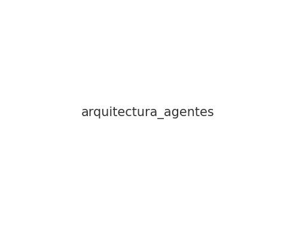

# Proyecto Final: Arquitecturas Agénticas para Text & Web Analytics

## 📌 Descripción General
Este proyecto implementa un **Sistema Multi-Agente Secuencial** capaz de automatizar el análisis de noticias políticas mediante técnicas de Text & Web Analytics.  
Incluye scraping, resumen con LLMs, extracción de entidades (NER), análisis de sentimiento y almacenamiento persistente del estado.

---

## 🧠 Arquitectura del Sistema

El sistema sigue un **Patrón Secuencial/Jerárquico**, donde cada agente transforma el estado y lo pasa al siguiente:

```
InputAgent → WebScraperAgent → SummarizerAgent → TextAnalyticsAgent → MemoryAgent → OutputAgent
```

### 📊 Diagrama de Arquitectura


Este grafo representa los nodos (agentes) y aristas (flujo de datos) en el sistema multi-agente.

---

## 🧩 Justificación del Patrón Elegido

Se eligió el **Patrón Secuencial/Jerárquico** porque:

- El flujo del procesamiento es **lineal y determinado**.
- Cada agente depende del resultado del paso anterior.
- No existen bifurcaciones, decisiones ni paralelismos.
- Es el patrón recomendado por Google Cloud para tareas con **transformaciones encadenadas**.
- Facilita la trazabilidad, modularidad, escalabilidad y depuración.

---

## 📦 Estructura del Repositorio

```
src/
  agents/
  utils/
  main.py
pipeline/
  Arquitecturas Agenticas-Lina Ramirez y Sandra Murillo.ipynb
docs/
  informe_proyecto.pdf
diagrams/
  arquitectura_agentes.png
data/
presentation/
README.md
requirements.txt
LICENSE
```

---

## 🛠 Instalación

### 1. Clonar el repositorio
```
git clone https://github.com/usuario/proyecto-agentes.git
cd proyecto-agentes
```

### 2. Crear entorno virtual (opcional)
```
python -m venv venv
source venv/bin/activate       # Windows: venv\Scripts\activate
```

### 3. Instalar dependencias
```
pip install -r requirements.txt
```

---

## ▶️ Ejecución del Sistema

### Ejecutar el pipeline principal:
```
python src/main.py
```

### Ejecutar la versión notebook:
Abrir el archivo:
```
pipeline/Arquitecturas Agenticas-Lina Ramirez y Sandra Murillo.ipynb
```

---

## ✨ Autoras

- **Lina María Ramírez Guerra**  
- **Sandra Liliana Murillo Rojas**

Universidad de Bogotá Jorge Tadeo Lozano  
Especialización en Desarrollo de Bases de Datos  
Diciembre 2025

---

## 📄 Licencia
MIT License
